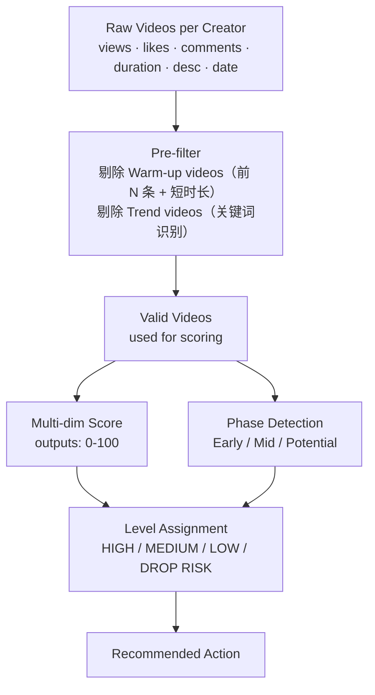

# 03 · Scoring Model · 评分模型详细设计

> 多维度评分 → 4 级分级 → 推荐动作。本文档详细说明每个维度的设计逻辑（具体权重以代号呈现，避免暴露业务规则）。

## 🏗️ Architecture



## 📐 Scoring Dimensions

模型用 **多个维度** 给每位大使打分（满分 100）。每个维度有自己的设计目的和相对权重（用 α/β/γ/... 表示，避免暴露具体数字）。

### 维度 1：100K+ 爆款数 · 强算法响应信号
```
if 100K+ videos exist:
    score += α   (高权重)
```
**为什么权重最高**：100K+ 是质变信号，证明账号能突破算法上限。一个 100K 爆款的招新价值 ≈ 多个 5K 视频的总和。

### 维度 2：10K+ 视频数 · 突破信号
```
if 10K+ videos exist:
    score += β   (中权重，约为 α/2)
```
**意义**：证明账号已经突破"小池子"，进入算法推荐扩散阶段。

### 维度 3：5K+ 视频数 · 初步算法响应
```
if 5K+ videos exist:
    score += γ   (轻权重)
```
**意义**：起步信号，算法开始"愿意推"。

### 维度 4：10K+ 命中率 · 算法响应稳定性
```
if hit_rate >= high_threshold:
    score += δ_high
elif hit_rate >= mid_threshold:
    score += δ_mid
```
**为什么用 rate 而非数量**：避免"运气好出过 1 个爆款"的假阳性。高命中率说明算法稳定喜欢这个账号。

### 维度 5：视频播放中位数 · 整体内容质量
```
按梯度加分:
    very high  → score += ε_4
    high       → score += ε_3
    moderate   → score += ε_2
    low        → score += ε_1
```
**为什么用中位数而非平均数**：平均数容易被单个爆款拉高（误判）；中位数代表"日常水准"。

### 维度 6：早期突破 · 加入后多久出第一个爆款
```
early = first 5 videos
if early contains 100K+: score += ζ_high
elif early contains 10K+: score += ζ_mid
elif early contains 5K+:  score += ζ_low
```
**意义**：早期突破（前 5 视频内出爆款）= 账号天赋好 + 算法快速识别 → 加分。

### 维度 7：后期反向扣分 · 拍了很多但没突破 = 警示信号
```
if n_valid >= threshold_1 and max_views < limit_1:
    score -= η_1   # 拍了较多视频但最高没破 5K
if n_valid >= threshold_2 and max_views < limit_2:
    score -= η_2   # 拍了很多视频但没有 10K 突破 = 严重警示
```
**为什么要扣分**：这是 [02-data-insight.md](02-data-insight.md) 里"30 视频判断爆款"洞察的直接应用——投入很多但回报极低 = 应该降低评分。

### 维度 8：Phase 阶段判断 · 给新人留余地
```
if n_valid <= early_cutoff:     phase = 'Early Validation'    # 数据不够，谨慎判断
elif n_valid <= mid_cutoff:     phase = 'Mid Validation'      # 进入观察期
else:                           phase = 'Potential Validation' # 数据充分，可下结论
```

### Phase 特殊保护规则

对 **Early Validation** 阶段（视频数较少）的特殊处理：

```
if phase == 'Early Validation' and level in ('LOW', 'DROP RISK'):
    if max_views >= protection_threshold or early_has_5k:
        # 给新人一点缓冲——"还看不出来"而不是"已经不行了"
        level = 'LOW'
        score = max(score, min_protected_score)
        reason += "Too early to judge — limited data but some positive signal"
```

**为什么需要这条**：避免误伤刚加入 2 周的新人——他们可能本来就是潜力股。

## 🎚️ Level Assignment

```
if score >= high_threshold:        level = 'HIGH'        🟢 重点培养
elif score >= medium_threshold:    level = 'MEDIUM'      🟡 持续观察
elif score >= low_threshold:       level = 'LOW'         🟠 警告期
else:                              level = 'DROP RISK'   🔴 清退候选
```

> 各 threshold 经多轮校准 + Coach 反馈调整后定型。

## 🎯 Recommended Actions

每个 Level 输出**一段具体建议**，让 Coach 拿到评分后**直接知道下一步做什么**：

| Level | Recommended Action |
|-------|-------------------|
| HIGH | 继续当前策略 · 考虑提高发视频频率以最大化势能 · 测试新内容格式以多样化增长 |
| MEDIUM | 算法在响应 · 持续测试模板 · 聚焦复制 Top 视频的成功要素 · 追求一致性 |
| LOW | review 内容策略 · 分析 Top 视频找规律 · 安排 coaching session 优化 hook 与内容质量 |
| DROP RISK | 需立即干预 · 安排 1-on-1 coaching · review 内容是否对齐平台最佳实践 · 评估是否继续投入 |

## 🛠️ Pre-filter Logic · Why It Matters

不是所有视频都参与评分。两类视频会被剔除：

### Warm-up Videos
```
if 视频在最早的前 N 条 and 视频时长 <= 短时长阈值:
    标记为 warm-up，不参与评分
```
**为什么剔除**：新账号通常前几条是"养号"测试视频，不代表正式内容能力。

### Trend Videos
```
TREND_KEYWORDS = [trend, viral, dance, challenge, duet, stitch, pov, grwm, 
                  transition, asmr, storytime, ...]

if 描述命中 trend 关键词 >= 阈值 AND 没有业务相关关键词:
    标记为 trend，不参与评分
```
**为什么剔除**：Trend 视频靠平台流量红利，不代表 Creator 自己的内容能力——它告诉你的是"热点跟得快"，不是"能持续产出"。

## 📊 Real-World Performance

| Cohort | Total | HIGH | MED | LOW | DROP RISK |
|--------|-------|------|-----|-----|-----------|
| Spring Semester | 600+ | ~8% | ~17% | ~25% | ~50% |

→ DROP RISK 比例 ~50% + 长期低评分 LOW 大使 → 经 Coach 复核后辅助清退 ~400 位。

---

[← Back to README](../README.md)
